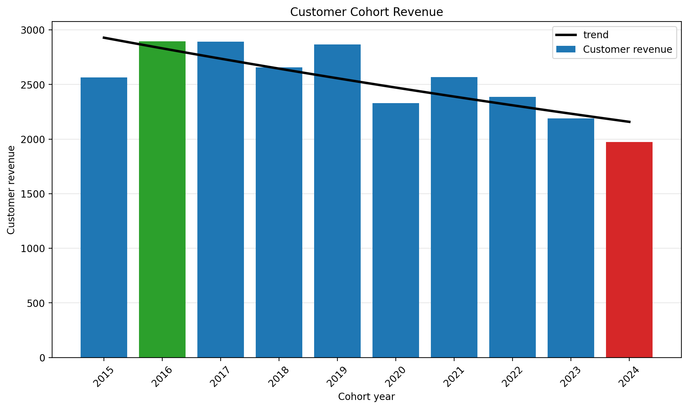

# Intermediate SQL - Sales Analysis
## Overview
- this analysis will answer three business questions by combination of SQL code and AI visualization
- the SQL analysis will pull the data from the view of the microsoft "contoso" sample database
    - the view is coded as following: [Base Data View](/Project_Linked/Cohort_Analysis.sql)

## Business Questions
1. Customer Segmentation: Who are our most valuable customers?
2. Cohort Analysis: How do different customer groups generate revenues?
3. Retention Analysis: Which customers haven´t purchased recently?
## Analysis Approach
### 1.
- categorize customers based on their total lifetime value (LTV)
- assign customers to High, Mid, and Low-value groups using CASE WHEN

**Query:** [1_customer_segmentation.sql](/Project_Linked/1_customer_segmentation.sql)

**Visualization:**

**Key Findings:**
- High-value segment (25% of customers) drives 66% of revenue (135.4M)
- Mid-value segment (50% of customers) generates 32% of revenue (66.6M)
- Low-value segment (25% of customers) accounts for 2% of revenue (4.3M)

**Business Insights:**
- High-Value (66% revenue):
    - Offer premium membership program to 12 372 VIP customers
    - Provide early access to new products and dedicated support
    - Focus on retention as losing one customer impacts revenue significantly
- Mid-Value (32% revenue):
    - Create upgrade paths for 24 743 customers through personalized promotions
    - Target with "next best product" recommendations based on high-value patterns
    - Potential  66.6M→ 135.4M revenue opportunity if upgraded to high-value
- Low-Value (2% revenue):
    - Design re-engagement campaigns for 12 372 customers to increase purchase frequency
    - Test price-sensitive promotions to encourage more frequent purchases
    - Focus on converting $4.3M segment to mid-value through targeted offers

### 2. Cohort Analysis
- tracked revenue and customer count per cohorts
- cohorts were grouped by year of first purchase
- analyzed customer retention at a cohort level

**Query:** [2_cohort_analysis.sql](/Project_Linked/2_cohort_analysis.sql)

**Visualization:**

**Key Findings:**
- revenue per customer shows a decreasing trend over time
    - 2022-2024 cohorts are performing worse than earlier cohorts
    - NOTE: although net revenue is increasing, this is likely due to a larger customer base, which is not reflective of customer value

**Business Insights:**
- value extracted from customer is decreasing over time and needs further investigation
- in 2023 we saw a drop in number of customers acquired
- with both lowering LTV and decreasing customer acquisition, the company is facing a potential revenue decline

### 3.
- identify customers who have churned and those who are active
- use ROW_NUMBER() to track last purchase while capturing revenues insights

**Business terms:** 
- Active Customer: Customer who made a purchase within the last 6 months
- Churned Customer: Customer who has not made a purchase in over 6 months

**Query:** [retention_analysis.sql](/Project_Linked/3_retention_analysis.sql)

**Visualization:**

**Key Findings:**

- long-term retention remains weak, with most cohorts stabilizing below 10% active
- without intervention, newer cohorts are likely to follow a similar churn pattern

## Technical Details
- **Database:** PostgresSQL
- **Analysis Tools:** PostreSQL, DBeaver, VSCode
- **Visualization:** ChatGPT
